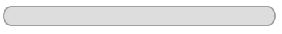
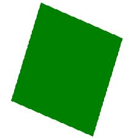

<!-- CSS3最新属性 -->
&ensp;&ensp;&ensp;&ensp;CSS3是最新的CSS标准，这套新标准提供了更加丰富且实用的规范，如：盒子模型、列表模块、超链接方式、语言模块、背景和边框、文字特效、多栏布局等等，本文将介绍一些常用的CSS3新增属性。
### 1.Animation
&ensp;&ensp;&ensp;&ensp;渲染元素的动画，它是一个简写属性，包括一下几个属性，
```
animation-name ：绑定到选择器的关键帧的名称
animation-duration ： 动画完成的时间
animation-timing-function ： 动画完成一个周期的方式
animation-delay ： 动画启动前的时间间隔 
animation-iteration-count ： 动画的播放次数
animation-direction ： 动画是否轮流反向播放
```

&ensp;&ensp;&ensp;&ensp;我们来看一个例子    
```
div
{
    width:100px;
    height:100px;
    background:red;
    position:relative;
    animation:mymove 5s infinite;
    -webkit-animation:mymove 5s infinite; /*Safari and Chrome*/
}
@keyframes mymove
{
    from {left:0px;}
    to {left:200px;}
}
@-webkit-keyframes mymove /*Safari and Chrome*/
{
    from {left:0px;}
    to {left:200px;}
}
```
    
注：IE9及以下的浏览器不支持Animation属性。
### 2.box-shadow
&ensp;&ensp;&ensp;&ensp;可以添加元素的阴影，可选属性有以下一些，
```
inset : 可选。将外部阴影（outset）改为内部阴影。
offset-x  : 必需。水平阴影位置。值为正投影在对象右边，值为负，投影在对象左边。
offset-y  : 必需。垂直阴影位置。值为正投影在对象低部。值为负，投影在对象顶部。
color : 阴影颜色。
blur : 可选。模糊距离
radial: 可选。扩展半径。
```

&ensp;&ensp;&ensp;&ensp;接下来看一个简单的效果图


CSS代码
```
div
{
    width:300px;
    height:100px;
    background-color:yellow;
    box-shadow: 10px 10px 5px #888888;
}
```

&ensp;&ensp;&ensp;&ensp;有一个新增的属性与其类似，text-shadow为文字添加阴影。
### 3.border-radius
&ensp;&ensp;&ensp;&ensp;可以添加元素的圆角，可以选择的属性是四个角的圆角值，
```
四个值: 第一个值为左上角，第二个值为右上角，第三个值为右下角，第四个值为左下角；
三个值: 第一个值为左上角, 第二个值为右上角和左下角，第三个值为右下角；
两个值: 第一个值为左上角与右下角，第二个值为右上角与左下角；
一个值： 四个圆角值相同，均为设定的值；
```

&ensp;&ensp;&ensp;&ensp;下面来看效果图

CSS代码
```
div
{
    border:2px solid #a1a1a1;
    padding:10px 40px; 
    background:#dddddd;
    width:300px;
    border-radius:25px;
}
```
### 4.box-image
&ensp;&ensp;&ensp;&ensp;可以设置图片的以下属性，
```
border-image-source ：　图片的路径
border-image-slice　：　图片边框向内偏移
border-image-width　：　图片边框的宽度
border-image-outset ：　边框图像区域超出边框的量
border-image-repeat ：　边框平铺(repeated)、铺满(rounded)或拉伸(stretched)。
```
注：IE不支持box-image属性

### 5.rgba
&ensp;&ensp;&ensp;&ensp;这是一个颜色选择器，相比较之前的rgb(红色R+绿色G+蓝色B)，多了一个强度的选项(Alpha，取值为0~1)。
```
rgba(10,20,20,0.3);
```

### 6.Gradient
&ensp;&ensp;&ensp;&ensp;渲染元素的渐变性，分为linear-gradient(线性渐变)和radical-gradient(水平渐变)，在不同的浏览器运行，属性前需要加不同的浏览器内核，

```
{
height: 200px;
background: -webkit-linear-gradient(red, blue);     /* Safari 5.1 - 6.0 */
background: -o-linear-gradient(red, blue);          /* Opera 11.1 - 12.0 */
background: -moz-linear-gradient(red, blue);        /* Firefox 3.6 - 15 */
background: linear-gradient(red, blue);             /* 标准的语法（必须在最后） */
}
```

&ensp;&ensp;&ensp;&ensp;效果图

注：IE9及更早的版本不支持渐变属性
### 7.text-shadow
&ensp;&ensp;&ensp;&ensp;渲染文字阴影，效果可以类比box-shadow。
### 8.transform
&ensp;&ensp;&ensp;&ensp;元素变形效果，可以将元素旋转、缩放和平移，该属性只适用于块状元素。
CSS代码
```
div
{
    position: absolute;
    width:200px;
    height:200px;
    /*让元素居中*/
    top: 0;
    bottom: 0;
    left: 0;
    right: 0;
    margin: auto;
    background-color:green;
    /*transform*/
    transform:rotate(20deg);                            //旋转
    //transform:translate(10,20);                       //平移
    //transform:scale(0.5,0.5)                          //缩放
   
}
```
旋转效果图


### 9.transition
&ensp;&ensp;&ensp;&ensp;元素过渡效果,控制动画速度,是一个简写属性，包括 transition-property（动画属性）, transition-duration(持续时间), transition-timing-function（动画的调速函数）, 和 transition-delay（开始延迟的时间），举一个简单的例子,运行1s后，在2s时间内，将一个div的透明度从0编导1。
```
div{
    width:100px;
    transition:opacity 2s linear 1s;
    background:yellow
}
```

### 10.媒体查询
&ensp;&ensp;&ensp;&ensp;随着移动设备的流行，前端开发的响应式设计也越来越重要，媒体查询可以针对不同
的浏览器和设备，让网页呈现不同的显示效果，
    ```
    @media screen and (min-width:600px) {  
    //body
    }
    @media screen and (max-width:599px) {
    //body
    }
    ```
&ensp;&ensp;&ensp;&ensp;改变窗口的大小，当越过600px这个边界时，会得到不一样的显示效果。
### 11.多列布局
&ensp;&ensp;&ensp;&ensp;多列布局可以让文本呈现多列显示，让我们首先通过一个效果的对比图看看多列布局的好处


CSS代码
```
.container{
    -moz-column-count: 3;
    -webkit-column-count: 3;
    column-count: 3;
}
```

&ensp;&ensp;&ensp;&ensp;是不是多列布局之后看着舒服多了呢。
### 12.Text-decoration
&ensp;&ensp;&ensp;&ensp;文字渲染，我们比较常用的有下划线（underline），在后面加后缀可以定义下划线的颜色粗细等属性，该属性不能被继承。
### 13.Flex
&ensp;&ensp;&ensp;&ensp;弹性盒子是CSS3新增的一种新的布局方式。由弹性容器(Flex container)和弹性子元素(Flex item)组成，其具体的实现原理在另一片“常用布局方式”的博文中有详细剖析，这里我们只用一个简答的例子看看其大致效果。
CSS代码
'''
.container {
      display: -webkit-flex;
      display: flex;
      border: solid;
}
.initial {
      -webkit-flex: initial;
              flex: initial;
      width: 200px;
      min-width: 100px;
      border: solid;
}
.none {
      -webkit-flex: none;
              flex: none;
      width: 200px;
      border: solid;
}
.flex1 {
      -webkit-flex: 1;
              flex: 1;
      border: solid;
}
.flex2 {
      -webkit-flex: 2;
              flex: 2;
      border: solid;
}
'''
效果图


<!-- -end -->


