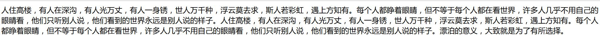
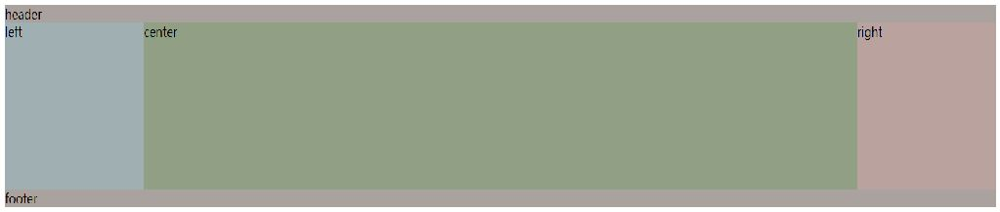
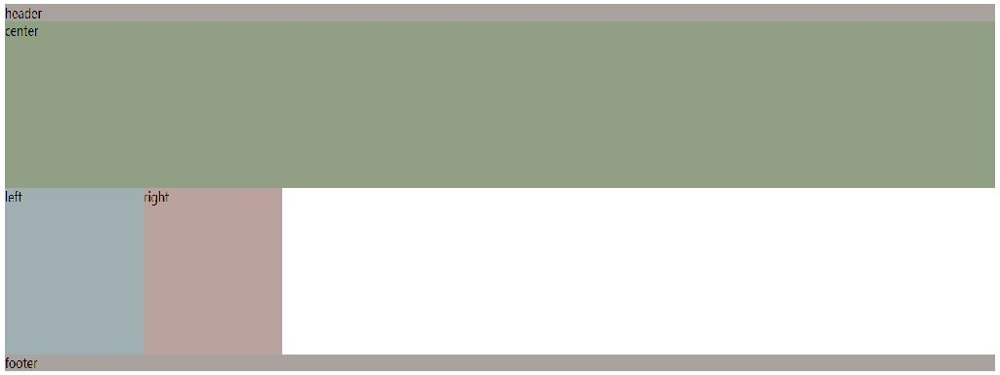
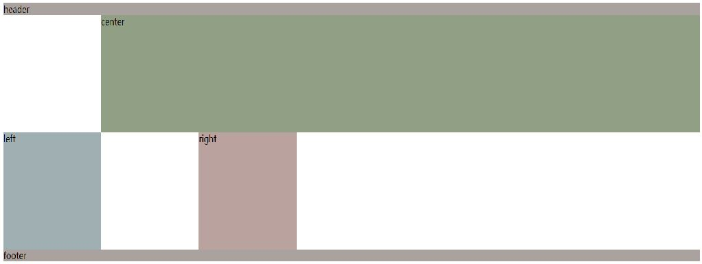
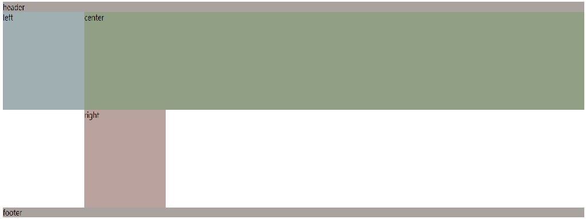

<!-- 常见布局方式 -->
&ensp;&ensp;&ensp;&ensp;CSS中，布局是一个非常重要的应用，布局的方式选择可以根据开发者的需求来决定，随着CSS的发展，可供我们选择的布局方式也越来越优良，本篇博文中，我们将介绍几种当下使用比较多的几种布局方式。
### 一、Flex布局
&ensp;&ensp;&ensp;&ensp;Flex布局是W3C2009年提出来的一种布局方式，目前已经得到了主流浏览器的支持,Webkit内核的浏览器，必须加上-webkit前缀Flex全称Flexible Box，意为弹性布局，首先来看一张简单的效果图,

html代码
```
<div class="container">
    <div class="initial">
    空间足够的时候，我的宽度是200px，如果空间不足，我会变窄到100px，但不会再窄了。
    </div>
    <div class="none">
    无论窗口如何变化，我的宽度一直是200px。
    </div>
    <div class="flex1">
    我会占满剩余宽度的1/3。
    </div>
    <div class="flex2">
    我会占满剩余宽度的2/3。
    </div>
</div>
```

CSS代码
```
.container {
  display: -webkit-flex;
  display: flex;
  border: solid;
}
.initial {
  -webkit-flex: initial;
          flex: initial;
  width: 200px;
  min-width: 100px;
  border: solid;
}
.none {
  -webkit-flex: none;
          flex: none;
  width: 200px;
  border: solid;
}
.flex1 {
  -webkit-flex: 1;
          flex: 1;
  border: solid;
}
.flex2 {
  -webkit-flex: 2;
          flex: 2;
  border: solid;
}
```

&ensp;&ensp;&ensp;&ensp;效果图中的四列，左边的两列宽度固定，右边两列的宽度视窗口的宽度变化。这种特性使得其很适合移动设备的响应式开发。
&ensp;&ensp;&ensp;&ensp;接下来我们来看看Flex布局的基本概念和属性，采用Flex布局的元素可以看作一个容器，容器内有两根轴，水平主轴和竖直轴(两根轴可以交换，默认水平轴为主轴)，容器上有六个属性，flex-direction、flex-wrap、flex-flow、justify-content、align-items、align-content，启用设置得比较多的是justify-content(设置元素居中时经常用到)和align-items，具体的取值如下，
##### justify-content
&ensp;&ensp;&ensp;&ensp;该属性设置主轴上的对齐方式，有五个可取值，
```
flex-start（默认值）： 左对齐
flex-end : 右对齐
center ： 居中
space-between ： 两端对齐，元素之间间隔相等
space-around ： 元素之间间隔相等，元素与元素间的间隔比元素与边框间的间隔大一倍
```

##### align-items
&ensp;&ensp;&ensp;&ensp;该属性设置在交叉轴上的对齐方式，同样有5个可选值,
```
stretch（默认值）： 如果元素未设置高度或设为auto，将占满整个容器的高度。
flex-start : 交叉轴的起点对齐
flex-end : 交叉轴的终点d对齐
center ： 交叉轴中点对齐
baseline ： 第一行文字基线对齐
```

### 二、栅栏布局
&ensp;&ensp;&ensp;&ensp;栅栏布局是前端框架Bootstrap中的一种布局方式，这是一个响应式、移动设备优先的流式栅格
系统，它将整个容器划分为宽度相等的12列，设置元素所占列的数目，从而确定元素的宽度，首先来看一个基本的效果图。

html代码
```
<div class="grid-container">
    <div class="row">
        <div class="col-md-4 col-sm-6">
            <p>content</p>
        </div>
        <div class="col-md-4 col-sm-6">
            <p>content</p>
        </div>
        <div class="col-md-4 col-sm-12">
            <p>content</p>
        </div>
    </div>
    <div class="row">
        <div class="col-md-3 col-sm-3">
            <p>content</p>
        </div>
        <div class="col-md-6 col-sm-6">
            <p>content</p>
        </div>
        <div class="col-md-3 col-sm-3">
            <p>content</p>
        </div>
    </div>
    <div class="row">
        <div class="col-md-1 col-sm-2">
            <p>content</p>
        </div>
        <div class="col-md-1 col-sm-2">
            <p>content</p>
        </div>
        <div class="col-md-2 col-sm-8">
            <p>content</p>
        </div>
        <div class="col-md-2 col-sm-3">
            <p>content</p>
        </div>
        <div class="col-md-6 col-sm-3">
            <p>content</p>
        </div>
    </div>
</div>
```

CSS代码
```
div{
    border : 2px solid rgba(82,12,12,0.5);
            
}
```

注：要引入borstrap.css
&ensp;&ensp;&ensp;&ensp;栅栏布局的一个特点是移动设备优先，我们来看一个表格，看看栅栏布局如何跨设备工作。

### 三、多列布局
&ensp;&ensp;&ensp;&ensp;多列布局是CSS3中引进的，是传统布局方式的扩充，让文本呈现多列显示，首先看一个简单的效果对比图,
    
    
CSS代码
```
.container{
    -moz-column-count: 3;
    -webkit-column-count: 3;
    column-count: 3;
}
```

&ensp;&ensp;&ensp;&ensp;是不是多列布局看着舒服多了呢。  
&ensp;&ensp;&ensp;&ensp;到目前为止，多列布局已经获得了主流浏览器的支持，但为了保证浏览器最大的兼容性，我们在使用多列布局属性时，最好添加浏览器引擎前缀，谷歌浏览器前面加上-webkit-，火狐浏览器前面-moz-，IE浏览器前面加上-ms-。
### 四、圣杯布局&&双飞翼布局
&ensp;&ensp;&ensp;&ensp;将这两种布局 方式放在一起，是因为它们的表现形式类型，只是在实现方法上有些许不同，它们都是三列布局，两边宽度固定，中间自适应。    
&ensp;&ensp;&ensp;&ensp;圣杯布局，首先来看代码和效果图（简单粗暴），我们再来一起研究实现原理。
CSS代码
```
body{
    min-width: 550px;      /* 2x LC width + RC width */
}
#container {
    padding-left: 200px;   /* LC width */
    padding-right: 200px;  /* RC width */
}
#container .column {
    height: 200px;
    position: relative;
    float: left;
}
#center {
    background-color: #e9e9e9;
    width: 100%;
}
#left {
    background-color: red;
    width: 200px;          /* LC width */
    right: 200px;          /* LC width */
    margin-left: -100%;

}
#right {
    background-color: blue;
    width: 200px;          /* RC width */
    margin-right: -100%;  /* RC width */

}
#footer {
   clear: both;
}
#header, 
#footer {
   background-color: #c9c9c9;
}
```

HTML代码
```
<div id="header">#header</div>
<div id="container">
   <div id="center" class="column">#center</div>
   <div id="left" class="column">#left</div>
   <div id="right" class="column">#right</div>
</div>
<div id="footer">#footer</div>
```

效果图

&ensp;&ensp;&ensp;&ensp;接下来我们来看看其实现机理，首先，我们应注意，在HTML中，我们必须将center放在首位，设置好width为100%，我们来详细看一下他的实现原理。
(1)首先设置好center，left，right的宽度和背景颜色，将三列均设置为左浮动和相对定位，他的效果是这个样子的~

三列content的CSS代码
```
.container {
}
.container .content {
  height: 200px;
  position: relative;
  float: left;
}
#center {
  background-color: rgba(36,66,9,0.5);
  width: 100%;
}
#left {
  background-color: rgba(16,56,62,0.4);
  width: 200px;          /* LC width */
}
#right {
  background-color: rgba(82,23,12,0.4);
  width: 200px;          /* RC width */
}
```

&ensp;&ensp;&ensp;&ensp;我们看到center的width占据了100%，left和right被挤到了下一行，我们如何让他们和center并列呢。
(2)我们将container的padding-left设置为left的宽度值，将left向左移动其宽度值（right：200px），然后设置其margin-left为-100%，便可以将其移动到center的左边，效果图~


三列content的CSS代码
```
.container {
  padding-left: 200px;   /* LC width 
 
}
.container .content {
  height: 200px;
  position: relative;
  float: left;
}
#center {
  background-color: rgba(36,66,9,0.5);
  width: 100%;
}
#left {
  background-color: rgba(16,56,62,0.4);
  width: 200px;          /* LC width */
  right: 200px;          /* LC width */
  margin-left: -100%;
}
#right {
  background-color: rgba(82,23,12,0.4);
  width: 200px;          /* RC width */
}
```

&ensp;&ensp;&ensp;&ensp;接下来我们要做的就是把right放到center的右边,经过刚刚处理left的操作，大家有没有想到方法呢。
(3)我们将container的padding-right设置为right的宽度值，然后设置right的margin-right为-100%（注意这里三列设置的都是左浮动），便可以得到我们想要的效果。

&ensp;&ensp;&ensp;&ensp;双飞翼布局和圣杯布局的实现效果是一样的，实现原理也很类似，差别在于双飞翼布局在middle内存再加了一个div，不用设置相对布局（也不用设置left&right），具体的CSS代码是这样的~
```
.container .content {
  height: 200px;
  float: left;
}
#center {
  background-color: rgba(36,66,9,0.5);
  width: 100%;
}
.centercontent{
    margin-left: 200px;
    margin-right: 200px;
}
#left {
  background-color: rgba(16,56,62,0.4);
  width: 200px;          /* LC width */
  margin-left: -100%;
}
#right {
  background-color: rgba(82,23,12,0.4);
  width: 200px;          /* RC width */
  margin-left:  -200px;  /* RC width */

}
```
### 几种布局方式的对比
&ensp;&ensp;&ensp;&ensp;布局方式有很多，我们要根据自己的需求选择最适合项目的布局方式，在以上几种布局方式中,栅栏布局和Flex适合响应式设计，多列布局适合纯文本的排版，比如报纸杂志等的设计,圣杯布局和双飞翼布局的使用可以根据自己的习惯来选择。


